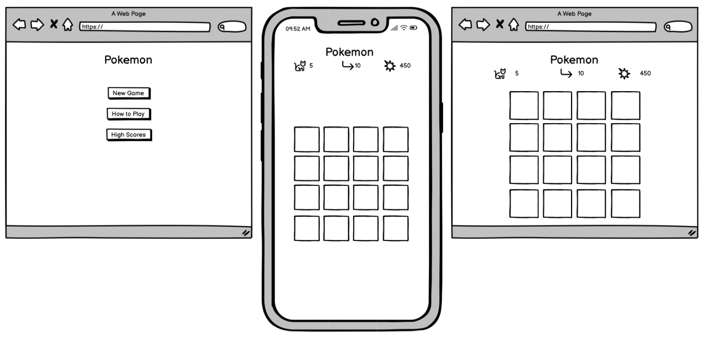

# Pokémon Memory Match Game

Link to live project: [Pokémon Memory Match](https://bizboz1981.github.io/ms2_pokemon_memory_match/)

## Table of Contents

[Project Background & Summary](#project-background--summary)
[User Experience (UX)](#user-experience-ux)  
[Features & Structure](#existing-features)  
[Design](#design)  
[Technologies Used](#technologies-used)  
[Testing](#testing)  
[Deployment](#deployment)  
[Credits](#credits)  
[References & Resources Used](#references--resources-used)

# Project Background & Summary
This game was driven by several motivating factors: a desire to make a game that I, and my children, would enjoy playing; a general desire to push myself technically; and a specific desire to work with REST APIs. After toying with the idea of making a side-scroller, I fairly quickly decided that this was not only very risky, but wouldn't necessarily provide the broadest learning opportunities. A card pair-matching game, however, would be flexible enough to allow a very simple version (at its most basic), but could also be extended and refined almost infinitely depending on how much time, energy and (not least) imagination I had. My hope was to use the PokeAPI to get enough data to make any of a large number of cards without having to resort to hard-coding a small number of image files in my project directories. I knew this was theoretically possible because I had seen a [similar project](https://github.com/jamesqquick/javascript-memory-match/tree/master) on YouTube. I must credit this project for my initial version of the ```loadPokemon()``` function (although I have reworked it incrementally over the course of the project). I was determined not to include any code I don't fully understand, so I must also credit [CodeCademy.com](http://codecademy.com) for the crash course on asynchronous javascript that was invaluable to my learning journey.

Apart from asynchronous javascript, the use of ```localStorage``` was completely new to me, and while relatively challenging to get right, it was at least more intuitive than ```async...await```. I also found the timer to be somewhat unintuitive, as well as 

<!--------------------------------------------------------User Experience -->

## User Stories
### First Time Visitor Goals
1.  As a First Time Visitor, I want to easily understand the main purpose of the game and how to play it.
2.  As a First Time Visitor, I want to be able to start a new game quickly and without confusion.
3.  As a First Time Visitor, I want the game to be visually appealing and engaging.
### Returning Visitor Goals
1.  As a Returning Visitor, I want to see any new features or improvements in the game.
2.  As a Returning Visitor, I want to challenge myself by beating my previous scores or times.
3.  As a Returning Visitor, I want to find a way to give feedback about the game.
### Frequent Visitor Goals
1.  As a Frequent Visitor, I want to see my highest scores and fastest times displayed.
2.  As a Frequent Visitor, I want to experience smooth game-play without any bugs or issues.
3.  As a Frequent Visitor, I want to be informed about any upcoming updates or new features.

<!--------------------------------------------------------Features -->
# Features & Structure
## Existing Features
##### Landing Page, Menu & Navigation
The landing page is designed to be visually appealing and simple. The user is presented with three buttons, which are clearly labelled, and should be very intuitive. Because this is a single page application, the buttons are not links to other pages; rather, they are controlled by javascript that shows and hides DOM elements depending on what has been clicked. This is achieved in two ways: firstly by adding or removing an html class attribute "hidden" (with associated css selector), and secondly by setting element.style.display = "none" (or "flex" etc.). The result is a much faster and user-friendly experience. This main menu is the section players return to after playing, checking the highscores, or reading the instructions.
##### How to Play
The game is, in essence, very simple and is familiar to many. This familiarity cannot be assumed, however, and so a 'how to play' section is essential for an optimal user experience. This section provides simple instructions as well as a short video demonstrating gameplay.
##### Difficulty Selector
After a player chooses 'New Game' they are prompted to choose the difficulty level. Difficulty can be adjusted in a simple but effective way: by increasing or decreasing the number of cards played with. At its simplest, the user plays with 8 cards (4 pairs), and at the other end of the scale, 24 cards (12 pairs).
##### Game Board
When the player clicks 'Play', the menu items are hidden and the game board displayed. The correct number of cards are displayed according to the number of pairs (difficulty) chosen. In order to ensure the cards are arranged in the ideal manner for the screen size and number of pairs, the grid dimensions are hard-coded according to conditional logic in the javascript. 
##### Score
This is populated at the end of the game, because score is not calculated cumulatively; rather it is a function of time taken and number of turns, so cannot be calculated in real time.
##### Timer
This starts as soon as the first card is clicked. It counts upwards in minutes and seconds and allows the player to track their progress. Time is used in calculating the final score.
##### Turn Counter
Increments by 1 for every 2 cards clicked (i.e. every turn) giving the user real-time feedback on their progress.
##### High Scores
At the end of the game the list of high scores displays. By checking their own score for the current game, players can check if they have made the leaderboard.

## Future Features
- Highscores to take user input for name
- If score makes highscore list, highlight it in the list
- Create button to reset highscore list
- Add a 'coming soon' features pipeline
<!--------------------------------------------------------Design -->
# Design
## Wireframes
These simple wireframes represent the simple, clean, intuitive and user friendly look that I was trying to achieve with this game.  


## Colour Scheme
The main background image was generated by AI (DALL-E) with a prompt that specifically mentioned a Japanese-inspired landscape in the Pokemon style. The result works very well, and is not subject to any copyright issues. The colour scheme of the buttons is taken directly from a sample of the blue and yellow of the Pokemon logo, and complement the background image beautifully.

<!--------------------------------------------------------Technologies -->
# Technologies Used
## Languages
- HTML5
- CSS3
- JavaScript
## Applications
- Git - for version control.
- GitHub - for version control and hosting.
- Visual Studio Code - for coding the project.
- Balsamiq - for wireframing.
## Frameworks, Libraries & CDNs
This project is intentionally built using vanilla javascript, css and html. However, I have used font awesome and google fonts.
## Other Tech & VS Code Extensions
* [GitHub CoPilot]([https://](https://github.com/features/copilot)) - I used this for checking code, troubleshooting and debugging - **not for writing code**.
* [Emmet](tps://code.visualstudio.com/docs/editor/emmet) - for boilerplate html and shortcuts.
* [Prettier](https://prettier.io) - for code formatting and code completion ('intellisense').
* [Live Server](https://marketplace.visualstudio.com/items?itemName=ritwickdey.LiveServer) - for live previewing of the site.
* [Markdown All in One](https://marketplace.visualstudio.com/items?itemName=yzhang.markdown-all-in-one) - for markdown editing.

## Learning Resources
I have credited specific resources throughout the code, but during my learning journey I have used the following resources extensively and my whole project has been inspired by elements of them all:
* [W3 Schools](https://www.w3schools.com) - used extensively for inspiration, problem solving and occasionally for template code.
* [Stack Overflow](https://stackoverflow.com) - primarily for troubleshooting issues.
* [Codecademy](https://www.codecademy.com) - as a user of Codecademy for a number of years, I must credit this site for any background knowledge I may have had.


<!--------------------------------------------------------Testing -->
# Testing
## User Testing
### First Time Visitor Goals & Experience
1. Understand the Main Purpose and How to Play:
- The home page provides a clear introduction to the Pokémon Memory Match game, explaining its purpose.
- The "How to Play" section offers straightforward instructions, ensuring that first-time visitors can quickly grasp the game mechanics.
2. Start a New Game Quickly and Without Confusion:
- A prominent "Start Game" button on the home page allows users to begin playing immediately.
- The game interface is intuitive, with easily recognizable elements such as cards and a restart button, facilitating a seamless start.
3. Visually Appealing and Engaging:
- The game features vibrant and familiar Pokémon characters, appealing to fans of the franchise.
- The responsive design and engaging animations enhance the visual appeal and user engagement.

### Returning Visitor Goals
1. See New Features or Improvements:
- I plan to add a 'coming soon' pipeline of new features (see above).
2. Challenge Themselves by Beating Previous Scores or Times:
- A scoreboard or timer feature allows returning players to track their progress and aim to improve their performance in subsequent sessions.
3. Provide Feedback About the Game:
- If there's a bug in the game that users experience, I, the developer, need to know about it in order to fix it. Otherwise no one will play the game anymore. This is an essential feature. However, developing a feedback form was beyond the scope of this project, so I have therefore just created an email link in the footer.
### Frequent Visitor Goals
1. Display Highest Scores and Fastest Times:
- The game tracks and displays the highest scores, providing frequent visitors with clear goals and incentives to keep playing.
2. Experience Smooth Gameplay Without Bugs or Issues:
- Rigorous testing ensures that the game runs smoothly across different devices and browsers, minimizing disruptions and enhancing the user experience.
- Backup pokemon provide a way for players to play the game even if calls to the Pokeapi fail.
3. Be Informed About Upcoming Updates or New Features:
- I plan to add a 'coming soon' pipeline of new features (see above).
## Manual Testing
### Features Testing
| Feature                | Test Case                                     | Outcome                                                       |
| ---------------------- | --------------------------------------------- | ------------------------------------------------------------- |
| Start Game Button      | Click to start a new game                     | Game starts successfully                                      |
| Card Flip              | Click on a card to flip it                    | Card flips and reveals Pokémon                                |
| Matching Cards         | Match two cards                               | Cards remain flipped when matched                             |
| Mismatched Cards       | Select two different cards                    | Cards flip back after a short delay                           |
| Restart Button         | Click to restart the game                     | Game restarts and shuffles cards                              |

### Device & Browser Responsiveness Testing
| Device/Browser        | Appearance | Responsiveness | Issues                        |
| --------------------- | ---------- | -------------- | ----------------------------- |
| iPad Air/Safari       | Good       | Good           | None                          |
| iPhone 14 Pro/Safari  | Good       | Good           | None                          |
| iPhone 14 Pro/Firefox | Good       | Good           | None                          |
| iPhone 14 Pro/Chrome  | Good       | Good           | None                          |
| MacBook Air/Safari    | Good       | Good           | None                          |
| MacBook Air/Chrome    | Good       | Good           | None                          |
| MacBook Air/Firefox   | Good       | Good           | None                          |
| Windows 10/Chrome     | Good       | Good           | None                          |
| Windows 10/Edge       | Good       | Good           | None                          |


## Online Validation Services

### Lighthouse
The results of the Lighthouse report were satisfactory:  


### Web Aim Contrast Check
The results of the contrast check were satisfactory:  


### HTML Validator
HTML Validator - the game received a clean bill of health, with no errors or warnings to show.  


### CSS Validator
CSS Received a clean bill of health: no errors and just a single warning that -webkit-user-select is a vendor extension.  


### Bugs
The game does not work well on mobile devices in landscape mode. A media query was therefore added to target landscape mobiles and then to hide all game content (except the title) and display a message to turn the phone to portrait mode.


### accessiBe
[accessiBe](https://accessibe.com/accessscan) accessibility scan informs me that the website is mostly compliant, but did suggest some areas for improvement, which I will address in future updates., Interestingly, the Code Institute site fails on many of the same elements, suggesting that 'accessibility' is more of an ongoing commitment rather than a realistic, perfect end-state.

<!--------------------------------------------------------Testing -->
# Deployment
My [site](https://github.com/bizboz1981/ms2_pokemon_memory_match) is deployed to [GitHub Pages](https://pages.github.com). 

### Forking this project for local development
If you would like to fork this repo and use it to create your own site, I would be delighted. Just follow these steps.

1. Fork the repo into your own GitHub account.
2. After forking, navigate to the new repo in your own account. Click on the green 'Code' button and copy the URL.
3. Navigate to the directory where you want to clone the repo, open a terminal, and run: `git clone <copied-URL>`.
4. You can now start working on the project in your favourite editor (I use VS Code).
5. After making changes, commit them to your local repo using:
```
git add .
git commit -m "commit message here
```
6. Push the changes to your forked repo on GitHub:
```
git push origin main
```
### Deploying the project
1. The next step is to deploy the project. I published my website to GitHub pages.
2. Navigate to your repo, in my case https://github.com/bizboz1981/ms2_pokemon_memory_match.
3. Click on Settings > Pages.
4. Choose Source: deploy from a branch.
5. Select the branch main/(root).
6. GitHub will then furnish you with a URL in the format 'https://yourusername.github.io/repositoryname'.
7. Updates to your site that you push to GitHub will automatically be deployed.


# Credits
In addition to the technologies used, I would like to credit the following for inspiration and assistance:
* My mentor, Jack Wachira, who has provided inspiration, guidance, and talked me out of some of my more hair-brained ideas!
* [Krystina Wach's game](https://github.com/Cushione/four-seasons-memory-game/tree/main) which inspired me: I love the game mechanics as well as the look and feel.
* [James Quick's game](https://github.com/jamesqquick/javascript-memory-match/blob/master/app.js) which provided inspiration and confidence that my idea is indeed possible. I also must credit this game as the original source of one particular function, loadPokemon; although I have refactored and changed the function over the course of development, to have a functioning api call 'out-of-the-box' early on was very useful indeed.


# References & Resources Used

-   https://photics.com/flipping-a-card-with-html-css-javascript/
-   https://www.thatsoftwaredude.com/content/6196/coding-a-card-deck-in-javascript
-   https://www.w3schools.com/howto/howto_css_flip_card.asp
-   https://github.com/Cushione/four-seasons-memory-game/tree/main
-   https://stackoverflow.com/questions/2450954/how-to-randomize-shuffle-a-javascript-array
-   https://stackoverflow.com/questions/45960216/insert-array-of-elements-into-the-dom // insert array of elements to DOM?
-   https://photics.com/flipping-a-card-with-html-css-javascript/
-   https://stackoverflow.com/questions/55175428/the-this-keyword-not-working-with-arrow-functions /// cannot use 'this.' inside arrow functions, refactor to regular func
-   https://stackoverflow.com/questions/17123327/align-text-to-the-bottom-of-a-div - align text in cardgood
-   https://css-tricks.com/almanac/selectors/a/attribute/ - use data attr as css selectors
-   https://stackoverflow.com/questions/6890218/css-background-image-opacity - background opacity
-   https://stackoverflow.com/questions/31559469/how-to-create-a-simple-javascript-timer - add a timer
-   https://developer.mozilla.org/en-US/docs/Web/API/clearInterval - clear timer
-   https://developer.mozilla.org/en-US/docs/Web/JavaScript/Reference/Global_Objects/String/padStart - format timer
-   https://dev.to/jankapunkt/make-text-fit-it-s-parent-size-using-javascript-m40#fixed-width-auto-height - dynamically resize text
-   https://stackoverflow.com/questions/47817325/storing-my-game-score-in-local-storage - local storage
-   https://puzzles.bestforpuzzles.com/games/best-of-puzzles-codeword - scoring calculation
-   https://developer.mozilla.org/en-US/docs/Web/JavaScript/Reference/Statements/try...catch - try...catch
-   https://stackoverflow.com/questions/56974852/how-to-catch-the-status-code-when-fetch-fails-using-async-await - catch http response codes
-   https://stackoverflow.com/questions/4919076/outline-effect-to-text - text outline
-   https://www.w3schools.com/jsref/prop_style_display.asp - set display to none instead of innerHTML = "";
-   https://stackoverflow.com/questions/11144274/javascript-changing-innerhtml-vs-display - innerHTML vs display
-   https://getbootstrap.com/docs/5.3/components/navbar/ - bootstrap navbar
-   https://getcssscan.com/css-buttons-examples - pre-styled button
-   https://developer.mozilla.org/en-US/docs/Web/API/Element/innerHTML - how the innerHTML property works re appending elements
-   https://www.w3schools.com/howto/howto_css_flip_card.asp - transparent card background
-   https://stackoverflow.com/questions/21664940/force-browser-to-trigger-reflow-while-changing-css, 
https://stackoverflow.com/questions/27637184/what-is-dom-reflow - resize text/reflow
-   https://ferie.medium.com/detect-a-touch-device-with-only-css-9f8e30fa1134, https://stackoverflow.com/questions/62182220/how-to-target-only-landscape-mobile-devices-without-affecting-desktop-via-css - target mobile devices in landscape
-   https://developer.chrome.com/docs/lighthouse/seo/meta-description/?utm_source=lighthouse&utm_medium=devtools - for SEO

